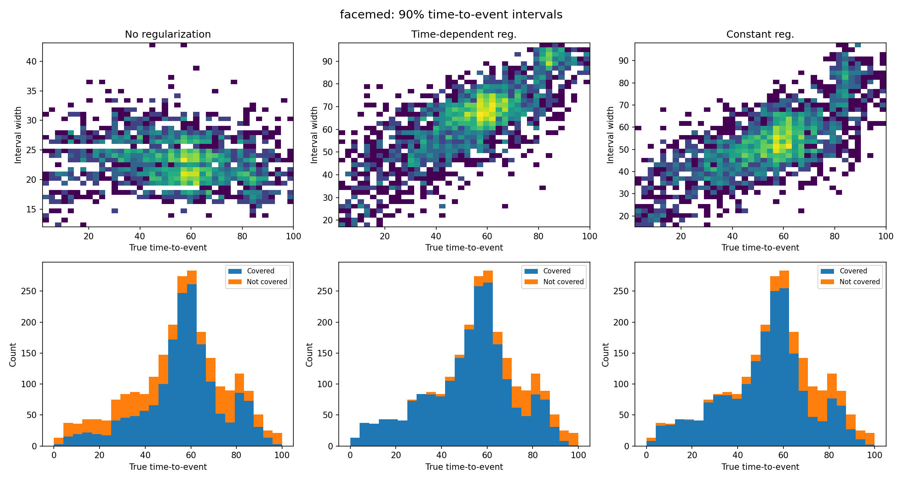
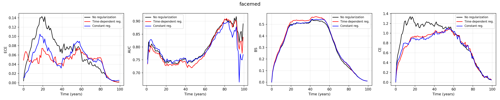

# foCus — Monte Carlo Uncertainty Quantification of Sequences

A simplified reference implementation for **"A Monte Carlo Framework for Calibrated Uncertainty
Estimation in Sequence Prediction"**, *Transactions on Machine Learning Research*, 2026.
[OpenReview](https://openreview.net/forum?id=sJE59flFC1)

The framework predicts a sequence of discrete labels from an image and quantifies
the uncertainty in that prediction. An autoregressive simulator is sampled many
times per input, and those samples are turned into marginal probabilities,
conditional probabilities, and time-to-event confidence intervals. Trained by
plain maximum likelihood the simulator is badly miscalibrated, especially at the
start of the sequence; a **time-dependent penalty on the logit norm** fixes it.

---

## Quick start

```bash
pip install -r requirements.txt
python smoke_test.py
```

`smoke_test.py` needs no data and no GPU. It generates miniature FaceMed and
Atari-HEAD fixtures, exercises both loaders, trains both decoders, draws Monte
Carlo sequences, and checks every metric — well under a minute. If it prints `30 passed, 0 failed`,
the installation is good.

---

## Repository map

| File | What it is |
|---|---|
| `configs.py` | Every scenario's settings and the λ schedules of Table 5 |
| `simulator.py` | CNN encoder + LSTM or Transformer decoder; the simulator of Section 3.2 |
| `losses.py` | The training loss of Equation (4) |
| `monte_carlo.py` | Equations (1) and (2), time-to-event, confidence intervals (Section 3.1) |
| `metrics.py` | ECE, macro AUC, Brier, cross entropy, coverage, width, MAE (Section 4.1, Appendix A) |
| `data_atari.py` | Atari-HEAD loader |
| `data_facemed.py` | FaceMed simulator and loader (Appendix B) — also a script that builds the dataset |
| `datasets.py` | Picks the right loader for a scenario |
| `train.py` | Trains one simulator |
| `evaluate.py` | Scores a checkpoint on the test set |
| `summarize.py` | Aggregates runs into the paper's tables and figures |
| `smoke_test.py` | End-to-end check requiring no data |

Scenario names: `seaquest`, `riverraid`, `bank_heist`, `hero`, `road_runner`, `facemed`.

---

## Data

### FaceMed (synthetic, Appendix B)

Download [UTKFace](https://susanqq.github.io/UTKFace/) (the aligned-and-cropped
release, 23,708 images whose filenames start with the subject's age), then:

```bash
python data_facemed.py --utkface_dir /path/to/UTKFace --out_dir data/facemed
```

This simulates one health trajectory per face with the age-dependent Markov chain
of Figure 5 — states healthy/ill/dead, one entry per year for 100 years — and
writes a single `facemed.npz` alongside a train/valid/test split. Because the
data-generating process is known, `data_facemed.ground_truth_marginals` gives the
*exact* marginals of Equation (9), and `evaluate.py` reports the RMSE of the
estimates against them (Section 6.1).

### Atari-HEAD (Section 4.2)

Download [Atari-HEAD](https://zenodo.org/record/3451402) and arrange it as:

```
<data_dir>/meta_data.csv
<data_dir>/<game>/<trial>.txt        one trajectory per trial
<data_dir>/<game>/<trial>.tar.bz2    the matching frames
```

Frames are unpacked on first use. Each frame becomes an input image whose target
is the actions that follow it up to the next scoring event, subsampled every
`frame_stride` frames and padded with an end-of-sequence token.

---

## Reproducing an experiment

Three steps: train, evaluate, summarize.

```bash
# 1. train one simulator per (scenario, regularization, seed)
python train.py --scenario seaquest --data_dir /data/Atari_HEAD \
    --regularization time_dependent --seed 100 \
    --out_dir runs/seaquest_time_dependent_seed100

# 2. score the final checkpoint on the held-out test set
python evaluate.py --scenario seaquest --data_dir /data/Atari_HEAD \
    --checkpoint runs/seaquest_time_dependent_seed100/checkpoint_final.pt \
    --out_dir runs/seaquest_time_dependent_seed100/eval

# 3. aggregate every run into tables and figures
python summarize.py --runs_dir runs --out_dir results
```

The paper compares three settings, which differ *only* in the λ vector:

| `--regularization` | Meaning |
|---|---|
| `none` | λ = 0; the maximum-likelihood baseline of Section 5 |
| `time_dependent` | The proposed schedule of Section 6 (Table 5) |
| `constant` | The same λ at every entry (Table 5) |

The full grid behind Tables 1–3 is 6 scenarios × 3 settings × 3 seeds:

```bash
for scenario in seaquest riverraid bank_heist hero road_runner; do
  for reg in none time_dependent constant; do
    for seed in 100 200 300; do
      python train.py --scenario $scenario --data_dir /data/Atari_HEAD \
          --regularization $reg --seed $seed \
          --out_dir runs/${scenario}_${reg}_seed${seed}
    done
  done
done
```

**Conditional probabilities (Table 2).** Pass `--condition_first_entry` to
`evaluate.py`. The test set is restricted to sequences that begin with that entry
and every sampled sequence is forced to start there, which is the estimand of
Equation (2). The value to use per scenario is `condition_first_entry` in
`configs.py` (Appendix D.2).

**Transformer (Appendix G).** Add `--decoder transformer` to both `train.py` and
`evaluate.py`.

**Sensitivity to where λ is applied (Appendix E).** Pass an explicit schedule,
e.g. `--lambdas 0,0,0,0.1` puts the penalty on the fourth entry only.

**Memory.** Sampling rolls out all `--n_samples` draws for a batch in parallel.
On long sequences, cap it with `--max_parallel_samples 25`.

---

## The regularization coefficients

The training loss (Equation 4) is

```
L = E[ sum_i  -log p(y_i | x, y_1..y_{i-1})  +  lambda_i * ||z_i||^2 ]
```

where `z_i` is the logit vector for entry i. `configs.py` stores λ exactly as
Table 5 reports it:

| Scenario | Time-dependent λ | Constant λ |
|---|---|---|
| Seaquest | λ₁:₃ = 0.05, 0.01, 0.05; λ₄:₂₀₀ = 0 | 0.001 |
| River Raid | λ₁:₆ = 0.01; λ₇:₃₀₀ = 0 | 0.001 |
| Bank Heist | λ₁ = 0.05; λ₂:₁₁ = 0.01; λ₁₂:₃₀₀ = 0 | 0.001 |
| H.E.R.O. | λ₁ = 0.01; λ₂:₆ = 0.005; λ₇:₃₀₀ = 0 | 0.001 |
| Road Runner | λ₁ = 0.01; λ₂:₂₁ = 0.005; λ₂₂:₃₀₀ = 0 | 0.001 |
| FaceMed | λ₁:₃ = 0.01; λ₄:₅ = 0.005; λ₆:₅₀ = 0.001 | 0.001 |

---

## Implementation notes

This is a simplified reimplementation of the original code, so it does not reproduce
the published numbers exactly. 

**Metric conventions.** AUC is undefined at entries where every sequence takes the
same class — common deep inside a padded sequence. Those entries are now NaN and
excluded from the average, where the original scored them as a perfect 1.0; this
lowers reported AUC. ECE weights each bin by its occupancy.

**Training-time evaluation uses the validation split** by default, leaving the
test set for the final `evaluate.py` run. Pass `--eval_split test` for the
test-set learning curves of Figures 13–15.

**The loss is averaged over the batch** rather than summed. With Adam this is
close to scale-invariant, but it is not bit-identical to the original.

 
---

## Reproduction check

The simplified reimplementation is tested on FaceMed. It ships evidence that the reimplementation moves calibration the way the paper reports. FaceMed was built from the real UTKFace release and trained for 200 epochs, three regularizations x two seeds, one V100 per run
(`experiments/facemed.sbatch`). Numbers are the held-out test split, mean +/-
standard error over seeds, as written by `evaluate.py` after training; the
tables in `docs/` carry the split and epoch in their own columns.

| Metric | none | time-dependent | constant | paper's best |
|---|---|---|---|---|
| ECE (down) | 0.0630 ± 0.0059 | **0.0470 ± 0.0018** | 0.0511 ± 0.0059 | time-dependent |
| AUC (preserved) | 0.8011 ± 0.0054 | 0.7906 ± 0.0085 | 0.7907 ± 0.0096 | all comparable |
| CE (down) | 0.8627 ± 0.0285 | 0.7324 ± 0.0122 | **0.7276 ± 0.0065** | time-dependent |
| Brier (down) | **0.3265 ± 0.0045** | 0.3424 ± 0.0060 | 0.3324 ± 0.0059 | time-dependent |
| Coverage of I(0.9), target 0.90 | 0.6865 ± 0.0295 | **0.8633 ± 0.0101** | 0.8257 ± 0.0051 | time-dependent |
| Relative width | 0.3857 ± 0.0337 | 1.1760 ± 0.0093 | 0.9730 ± 0.0020 | time-dependent widest |
| Relative MAE (down) | **0.1638 ± 0.0025** | 0.2516 ± 0.0036 | 0.2192 ± 0.0087 | none (trade-off) |
| RMSE vs exact marginals | **0.1491 ± 0.0024** | 0.1632 ± 0.0052 | 0.1550 ± 0.0050 | time-dependent |

**What reproduces.** The paper's two headline claims hold, with time-dependent
regularization best and the ordering matching the paper: calibration improves
(ECE 0.063 -> 0.047) and interval coverage moves toward its 0.90 target
(0.687 -> 0.863), while AUC is unchanged to within 0.01 -- better calibration is
not bought with discrimination. Cross entropy improves and the discriminability
/ calibration trade-off in the time-to-event intervals reappears exactly as in
Table 3: regularized intervals are wider and better covered, at some cost in MAE.

The interval behaviour of Figure 4 reproduces clearly:



Without regularization the interval width is a flat band, independent of the true
time-to-event -- the paper's observation that "the widths of the confidence
intervals remain invariant over time, which is undesirable as uncertainty should
increase with longer time horizons." With time-dependent regularization the width
scales with the true time, and the uncovered mass at short times largely
disappears.

**What does not reproduce.** Brier score and the RMSE against the exact
Equation (9) marginals do not move in the paper's direction: the unregularized
model stays ahead on both. The deviation is small, and it narrows as training
goes on -- the Brier gap falls from 0.022 at 100 epochs to 0.016 at 200, and the
RMSE gap from 0.019 to 0.014 -- which points at the shortened schedule used here
rather than in the paper.

Both are proper scoring rules, rewarding sharpness as well as calibration, and
the regularizer trades the one for the other. Years 21-40 make the trade
explicit: time-dependent regularization is much better calibrated there
(entry-wise ECE 0.053 against 0.104) at the cost of being less discriminative (entry-wise AUC 0.736 against 0.743). 
Its predictions are less extreme, which lowers ECE and AUC alike -- an
improvement in the first, a cost in the second.



The ECE panel shows where the calibration gain lives: from roughly year 4 to year
60. It is absent at the first few entries and after year 60, where the process is
close to deterministic -- every subject is healthy in year 1 and almost all are
dead after year 80 -- so confident predictions are simply correct and there is
little for the regularizer to fix. Worth bearing in mind when reading the FaceMed
row of Table 5, whose largest coefficients fall on entries 1-3.

**Caveats.** Two seeds rather than three, so the error bars are thin. The
effect is sensitive to training length: performance gap between regularized models and unregularized ones increases as training continues.

The per-run outputs and the aggregated CSVs behind this section are reproduced by:

```bash
python data_facemed.py --utkface_dir /path/to/UTKFace --out_dir data/facemed
sbatch --export=ALL,EPOCHS=200,RUNS_DIR=experiments/runs200 experiments/facemed.sbatch
python summarize.py --runs_dir experiments/runs200 --out_dir experiments/results200
```

---

## Citation

```bibtex
@article{yang2026focus,
  title   = {A Monte Carlo Framework for Calibrated Uncertainty Estimation in Sequence Prediction},
  author  = {Yang, Qidong and Zhu, Weicheng and Keslin, Joseph and Zanna, Laure
             and Rudner, Tim G. J. and Fernandez-Granda, Carlos},
  journal = {Transactions on Machine Learning Research},
  year    = {2026},
  url     = {https://openreview.net/forum?id=sJE59flFC1}
}
```


---

## License

Released under the [MIT License](LICENSE).

The datasets are distributed separately under their own terms:
[Atari-HEAD](https://zenodo.org/record/3451402) and
[UTKFace](https://susanqq.github.io/UTKFace/), the latter being available for
non-commercial research use only.
